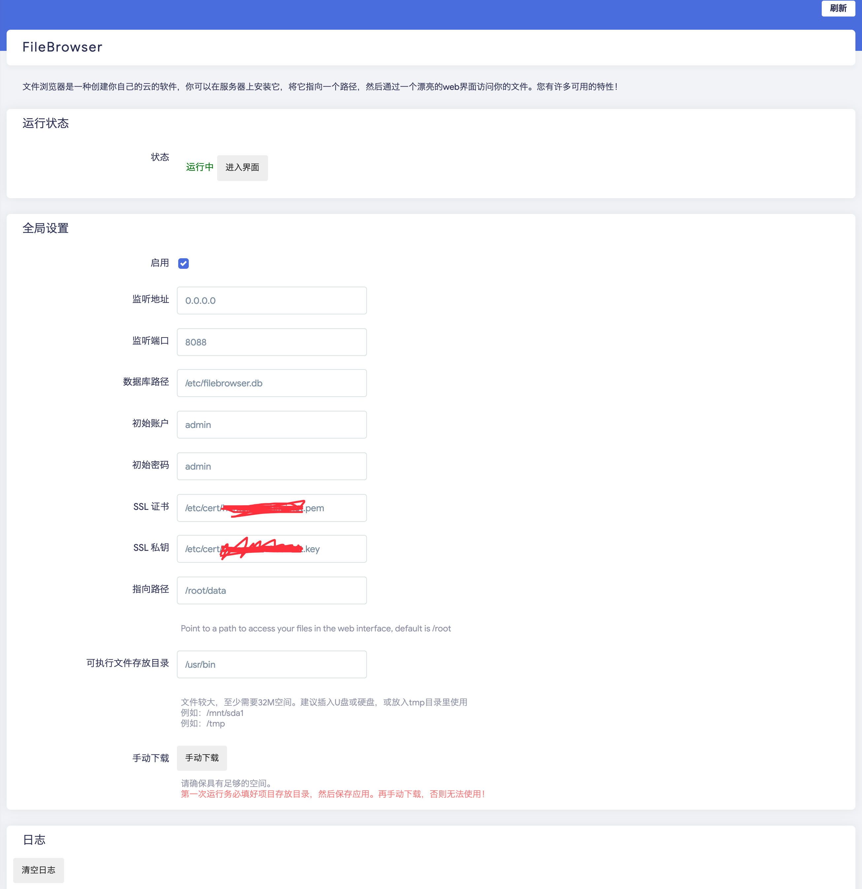

# luci-app-filebrowser
这是 [xiaozhuai/luci-app-filebrowser: luci filebrowser (github.com)](https://github.com/xiaozhuai/luci-app-filebrowser) 的一个分支，适配官方 master 分支。

在OpenWRT中配置filebrowser的LUCI应用

由于可执行文件很大，至少32MB，因此ipk中不集成filebrowser的可执行文件。

首次运行前，需要手动下载可执行文件，如果你的空间足够大，推荐可执行文件目录配置为`/usr/bin`，否则根据需要放到你认为合适的目录。（路径不能包含空格）

